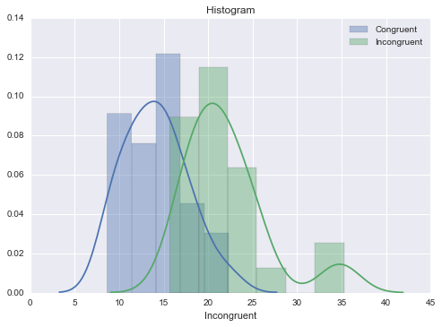

## Statistics: The Science of Decisions Project Instructions

#### Background Information

In a Stroop task, participants are presented with a list of words, with each word displayed in a color of ink. The participant’s task is to say out loud the color of the ink in which the word is printed. The task has two conditions: a congruent words condition, and an incongruent words condition. In the congruent words condition, the words being displayed are color words whose names match the colors in which they are printed: for example RED, BLUE. In the incongruent words condition, the words displayed are color words whose names do not match the colors in which they are printed: for example PURPLE, ORANGE. In each case, we measure the time it takes to name the ink colors in equally-sized lists. Each participant will go through and record a time from each condition.

#### Questions For Investigation

As a general note, be sure to keep a record of any resources that you use or refer to in the creation of your project. You will need to report your sources as part of the project submission.
1. What is our independent variable? What is our dependent variable?

2. What is an appropriate set of hypotheses for this task? What kind of statistical test do you expect to perform? Justify your choices.
Now it’s your chance to try out the Stroop task for yourself. Go to this link, which has a Java-based applet for performing the Stroop task. Record the times that you received on the task (you do not need to submit your times to the site.) Now, download this dataset which contains results from a number of participants in the task. Each row of the dataset contains the performance for one participant, with the first number their results on the congruent task and the second number their performance on the incongruent task.
3. Report some descriptive statistics regarding this dataset. Include at least one measure of central tendency and at least one measure of variability.
4. Provide one or two visualizations that show the distribution of the sample data. Write one or two sentences noting what you observe about the plot or plots.
5. Now, perform the statistical test and report your results. What is your confidence level and your critical statistic value? Do you reject the null hypothesis or fail to reject it? Come to a conclusion in terms of the experiment task. Did the results match up with your expectations?
6. Optional: What do you think is responsible for the effects observed? Can you think of an alternative or similar task that would result in a similar effect? Some research about the problem will be helpful for thinking about these two questions!

#### 1.What is our independent variable? What is our dependent variable?

Independen Variable = word condition: Congruent or Incongruent

Depedent Variable = Time to name the ink color of word list

#### 2.What is an appropriate set of hypotheses for this task? What kind of statistical test do you expect to perform? Justify your choices.

$H_0: \mu_1 = \mu_2$

$H_1: \mu_1 \neq \mu_2$

$\mu_1$: Population average time to finish Congruent task.

$\mu_2$: Population average time to finish Incongruent task.

I will use two-tail t-test with degree of freedom=23.  Reasons are:
- samples are paired, so we can reduce each pair of samples into $X=X_1-X_2$
- unknown means and unkown standard deviations.
- alternative hypothesis is non-directional, so two tail test will be used. 

#### 3.Report some descriptive statistics regarding this dataset. Include at least one measure of central tendency and at least one measure of variability.


```python
import pandas as pd
df = pd.read_csv("stroopdata.csv")
df.describe()
#mean = measure of central tendency
#std = measure of variability
```


<div>
<table border="1" class="dataframe">
  <thead>
    <tr style="text-align: right;">
      <th></th>
      <th>Congruent</th>
      <th>Incongruent</th>
    </tr>
  </thead>
  <tbody>
    <tr>
      <th>count</th>
      <td>24.000000</td>
      <td>24.000000</td>
    </tr>
    <tr>
      <th>mean</th>
      <td>14.051125</td>
      <td>22.015917</td>
    </tr>
    <tr>
      <th>std</th>
      <td>3.559358</td>
      <td>4.797057</td>
    </tr>
    <tr>
      <th>min</th>
      <td>8.630000</td>
      <td>15.687000</td>
    </tr>
    <tr>
      <th>25%</th>
      <td>11.895250</td>
      <td>18.716750</td>
    </tr>
    <tr>
      <th>50%</th>
      <td>14.356500</td>
      <td>21.017500</td>
    </tr>
    <tr>
      <th>75%</th>
      <td>16.200750</td>
      <td>24.051500</td>
    </tr>
    <tr>
      <th>max</th>
      <td>22.328000</td>
      <td>35.255000</td>
    </tr>
  </tbody>
</table>
</div>


#### 4.Provide one or two visualizations that show the distribution of the sample data. Write one or two sentences noting what you observe about the plot or plots.


```python
import seaborn as sns
import matplotlib.pyplot as plt
%matplotlib inline
sns.set(color_codes=True)
sns.distplot(df['Congruent'],label='Congruent')
sns.distplot(df['Incongruent'],label='Incongruent')
plt.title('Histogram')
plt.legend()
```


    <matplotlib.legend.Legend at 0xaaa9080>





Findings:
- The samples means are different
- Distribution of each sample looks like normal distribution.

#### 5.Now, perform the statistical test and report your results. What is your confidence level and your critical statistic value? Do you reject the null hypothesis or fail to reject it? Come to a conclusion in terms of the experiment task. Did the results match up with your expectations?


```python
import numpy as np
from scipy import stats
n=24
X = df['Congruent']-df['Incongruent']
mean = X.mean()
std = X.std()
freedom=23
CI = 0.95
print("t-statistic="+str(mean/(std/np.sqrt(n))))
print("critical value at CI="+str(CI)+str(stats.t.interval(CI,freedom)))
#use paired two sample t-test gives the same results
#stats.ttest_rel(df['Congruent'],df['Incongruent'])
#Ttest_relResult(statistic=-8.020706944109957, pvalue=4.1030005857111781e-08)

```

    t-statistic=-8.02070694411
    critical value at CI=0.95(-2.0686576104190406, 2.0686576104190406)
    

Reject Null Hypothesis since t-statistic is outside critical values.
Conclusion: People spend significant differnt time to finish conjuent and inconjuent tasks, which means that Incongruent words will interfere human's recognition ability.
The result confirms my expectation. 

#### 6.Optional: What do you think is responsible for the effects observed? Can you think of an alternative or similar task that would result in a similar effect? Some research about the problem will be helpful for thinking about these two questions!

Human brain requires more time to resolve the conflict color signals from contextual meaning and Visual colors. 

Alternative experiement can be based on Font Size and Word "Big" or "Small".  Ask participant to name the Size of the word instead of the contextual meaning.  Devide into similar Congruent and Incongruent groups and measure the time of reading them. 
